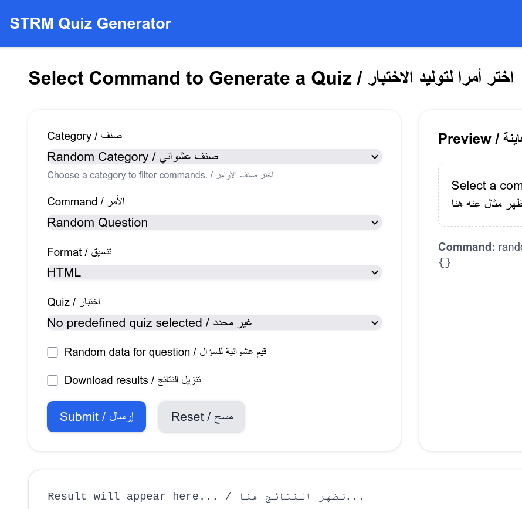

# STRM Tests

Create random tests for **Structure Machine 1 & 2** – First Year MI, Mathematics & Computer Sciences in Algerian universities.

This subject is also available for other branches such as:

- Electrical and mechanical engineering in colleges or universities

---

توليد الفحوص والأسئلة في مادة "بنية الآلة 1 و2" لشعبتي الرياضيات والإعلام الآلي في الجامعة الجزائرية.

هذه المادة متوفرة أيضا في شعب الهندسة الكهربائية والميكانيكية في الثانويات والجامعات.

---

## Features / مزايا

- ✅ Generate tests with solutions / توليد الفحوص والأسئلة مع الحلول
- 📚 Covers multiple topics / تدعم الفصول الآتية:
  - Number systems / أنظمة التعداد
  - Representation of integers, floats, and characters / تمثيل الأعداد الطبيعية والحقيقية والحروف
  - Information encoding / ترميز المعلومات
  - Boolean algebra / الجبر البولياني
- 🎨 Generates comprehensive answers / تولّد الأجوبة:
  - Draw logic function diagrams / إمكانية رسم مخطط دالة منطقية
  - Generate Karnaugh maps / توليد جداول كارنوف
  - Generate graphical solutions for Karnaugh maps / توليد الحلول البيانية لجدول كارنوف
- 🔄 Generate repeated versions for printing / توليد نماذج مكررة من الأسئلة لتسهيل الطباعة
- 🎲 Randomized question generation / توليد عشوائي للأسئلة

**Developer:** Dr. Taha Zerrouki – [tahadz.com](http://tahadz.com), [taha.zerrouki@gmail.com](mailto:taha.zerrouki@gmail.com)


---

## 🌐 Live Demo

Try it online: **[render](https://strm-tests.onrender.com/quiz?lang=en-ar)**

---

## Project Info

| Feature  | Value                                                                                                      |
| -------- | ---------------------------------------------------------------------------------------------------------- |
| Authors  | Taha Zerrouki – [tahadz.com](http://tahadz.com), [taha.zerrouki@gmail.com](mailto:taha.zerrouki@gmail.com) |
| Release  | 0.3                                                                                                        |
| License  | [GPL](https://github.com/linuxscout/strm-tests/blob/master/LICENSE)                                        |
| Tracker  | [Issues](https://github.com/linuxscout/strm-tests/issues)                                                  |
| Website  | [GitHub](https://github.com/linuxscout/strm-tests)                                                         |
| Source   | [GitHub](https://github.com/linuxscout/strm-tests)                                                         |
| Feedback | [Comments](https://github.com/linuxscout/strm-tests/issues)                                                |
| Accounts | [@linuxscout](https://x.com/linuxscout)                                                                    |

---

## 📋 Requirements

### For Running Tests:

```bash
pip install -r tests/requirements.txt
```

### For Producing LaTeX/PDF:

- Linux command line with `make`
- LaTeX distribution (`texlive`)

### For Web UI:

- FastAPI framework

```bash
pip install -r web/requirements.txt
```

---

## 🚀 Quick Start

### Option 1: 🐳 Run with Docker (Recommended)

You can run the entire app inside Docker — **no Python or LaTeX setup required**.

#### Build the Docker image

From the project root (`STRM/strm-tests`):

```bash
sudo docker build -t strm-app .
```

#### Run the container

```bash
sudo docker run -d -p 8000:8000 strm-app
```

#### Visit the application

👉 **[http://127.0.0.1:8000](http://127.0.0.1:8000)**

---

### Option 2: Web Interface (Local Installation)

```bash
uvicorn app:app --reload
```

Or using Make:

```bash
make server
```

---

### Option 3: Console Generation

Please see `Makefile` for more commands:

```bash
make test1
make test2
make test3
```

Generates LaTeX files in the `tmp/edits/` folder.

---

## 📄 Examples of Generated Quizzes

- [HTML](docs/examples/example-quizzes.html)
- [Markdown](docs/examples/example-quizzes.md)
- [LaTeX/PDF](docs/examples/example-quizzes.pdf)
- [Text](docs/examples/example-quizzes.txt)

---

## 📸 Web Screenshots



---

## 📁 Project Structure

```
strm-tests/
│
├── strmquiz/                # Core Python modules
├── templates/               # Jinja templates for LaTeX/HTML and future formats
├── web/                     # Web server based on FastAPI
├── tmp/edits/               # Generated LaTeX/PDF or HTML outputs
├── tests/                   # Unit tests
│   └── config/              # Sample config files
│       └── quiz.conf
└── Dockerfile               # Docker configuration
```

---

## 📚 Question Type Reference / أنواع الأسئلة

| Category / الفئة             | Command / الأمر | Explanation / الشرح                                                                                     |
| ---------------------------- | --------------- | ------------------------------------------------------------------------------------------------------- |
| Codage / الترميز             | `base`          | Convert between numeral bases / تحويل بين أنظمة التعداد                                                 |
| Codage / الترميز             | `arithm`        | Arithmetic operations between bases / إجراء العمليات الحسابية بين الأنظمة                               |
| Codage / الترميز             | `mesure`        | Conversion between measure units / تحويل بين وحدات القياس المختلفة                                      |
| Codage / الترميز             | `float`         | Floating-point representation (IEEE-754) / تمثيل الأعداد العشرية العائمة IEEE-754                       |
| Codage / الترميز             | `intervalle`    | Integer intervals with sign, complement 1 & 2 / فواصل الأعداد الصحيحة باستخدام الإشارة، المكمل 1 و 2    |
| Codage / الترميز             | `complement`    | Complement to one and two / المكمل إلى واحد واثنين                                                      |
| Logic / منطق                 | `exp`           | Simplify Boolean expression / تبسيط التعبير البولياني                                                   |
| Logic / منطق                 | `map`           | Simplify a Karnaugh map / تبسيط جدول كارنوف                                                             |
| Logic / منطق                 | `map-sop`       | Simplify Karnaugh map using canonical forms / تبسيط جدول كارنوف بالشكل القانوني                         |
| Logic / منطق                 | `function`      | Study a logical function / دراسة دالة منطقية                                                            |
| Logic / منطق                 | `static_funct`  | Study function given by canonical form / دراسة الدالة من النموذج القانوني                               |
| Logic / منطق                 | `multi_funct`   | Draw circuit with multiple functions given by min-terms / رسم دائرة منطقية بعدة دوال باستخدام المينترمز |
| Sequential / المنطق التعاقبي | `chronogram`    | Draw timing diagram with D, JK, RS flip-flops / رسم مخطط زمني باستخدام القلابات                         |
| Sequential / المنطق التعاقبي | `flip`          | Draw timing diagram with D, JK, RS flip-flops / رسم مخطط زمني باستخدام القلابات                         |
| Sequential / المنطق التعاقبي | `counter`       | Draw timing diagram with counters / رسم مخطط زمني للعدادات                                              |
| Sequential / المنطق التعاقبي | `register`      | Draw timing diagram with registers / رسم مخطط زمني للسجلات                                              |

---

## ⚙️ Using Config Files / استخدام ملفات الإعداد

You can configure multiple test generations in a config file.  
يمكنك استخدام ملف إعداد لتوليد عدة اختبارات.

**Examples / أمثلة:**

- `strmquiz/config/quiz_template.conf`
- `tests/config/*` (sample configurations)

---

## 🤝 Contribution / للمساهمة

Please refer to the development guide:  
اطلع على دليل التطوير:

📖 [Development Guide](docs/Contribution.md)

---

## 📖 Web API Documentation / توثيق الواجهة البرمجية

Please refer to the API documentation:  
اطلع على دليل الواجهة البرمجية:

📖 [API Documentation](docs/api.md)

---

## 📝 License

This project is licensed under the GPL License - see the [LICENSE](LICENSE) file for details.

---

## 💬 Support

If you encounter any issues or have questions:

- 🐛 [Report bugs](https://github.com/linuxscout/strm-tests/issues)
- 💡 [Request features](https://github.com/linuxscout/strm-tests/issues)
- 📧 Contact: [taha.zerrouki@gmail.com](mailto:taha.zerrouki@gmail.com)

---
